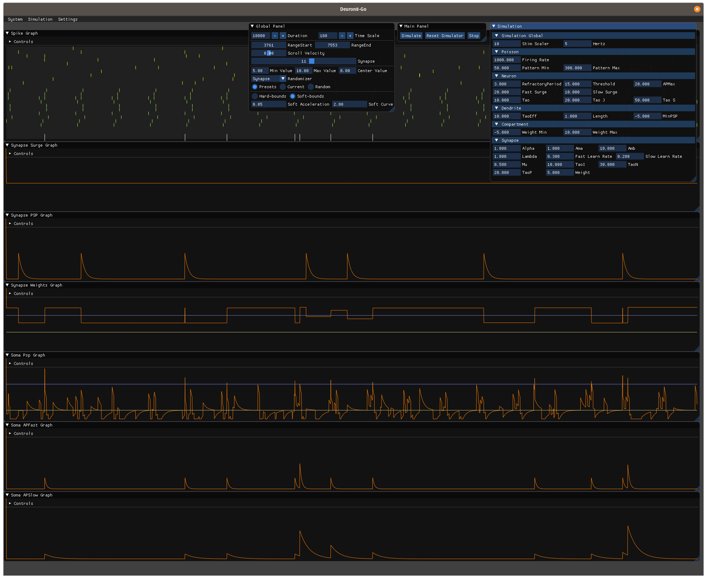

# Deuron 8 written in Go



# Simulation
The simulation makes two "passes" through the network for each
time step. Each step equals 10? microseconds.

Each simulation step works on the previous input. Each component
maintains an internal *current-state* and *next-state*.

The first pass exercises the inputs on each neuron.

The second pass moves the results of the first pass to the neuron's output. Note: the output of one neuron is the input of another, except for stimulus.

# Folders
* Deuron8-Go
    * api: the main api for the network approach
    * config:
    * examples:
    * log:
    * neuron_simulation: see folder [readme.md](neuron_simulation/readme.md)
    * simulation:
    * tests:
    * tools:

# Tasks
## Synaptic properties

At the start of a simulation the model is configured according to the initializer choice. The model is then copied to the runtime and the simulation is started. Once the simulation is complete the runtime is copied back to the model. The model can then be saved to **synapses.json**

Types of initializations possible:
* *Preset*: the synaptic properties are reset back to a set of Presets values from a fixed **synapsed_presets_*N*.json**.
* *Current*: the synaptic properties are not changed but continue forward. Any changes made to the model are used in the next simulation.
* *Random*: the synaptic properties are randomly changed prior to simulation. The only property currently supported is Weight.

## Applications
### Generators
A generator program will create json files for synapses. It reads a configuration json file to drive the generator. The generated file can be used by the simulator as a preset.

### Neuron simulator
This application simulates a single neuron.
It is located in the *neuron_simulation/app* folder
Executed as:
```
go run .
```

## Notes:

# Learning
The goal is to *try* and learn a pattern out of a Set. The Set size is 2 ot 3 patterns.

* Synapse #2 properties may be a good representative for other synapses
* Add two or more stimulus patterns

# Short term plasticity (STP)
STD/STF ... Articles:
* x

# Memory retention
* Add memory retention functionality. See **https://www.desmos.com/calculator/aj3e3r7ajf** for an equation.

Retension can last for 10s ms to days or even permanent.
Memory can be at the Soma or Synapse

# Misc
The weights are typically the short term memory until learning **Effort** is increased.
The other parameters, for example Tao, are controlled by a Meta system (EA for example). They are the slower changing parms that represent the charateristics of the neuron but also represent information at a meta level.

We have two json files: A Preset that can't be saved over and a version that is overlayed at the end of a simulation.

add random property generators, for example, randomly generate weights centered around a fixed value with a mean variance. Zero is a typical center value.
maybe have a listbox that you choose a property then select a max variance and center value. There could be presets.

Each time the sim starts we check if we use the fixed defaults, the current
weights or random values.